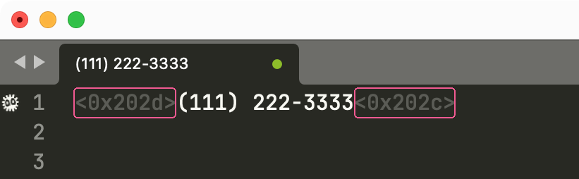

### About

Simple workaround for a bug in Contacts.app that pads copied phone numbers with zero-width characters, like this:

### References

- [Zero-width characters embedded in phone number whenever they are copied from the macOS address book](https://apple.stackexchange.com/questions/337101/zero-width-characters-embedded-in-phone-number-whenever-they-are-copied-from-the)
- specifically: [my answer](https://apple.stackexchange.com/a/350404/100302)
